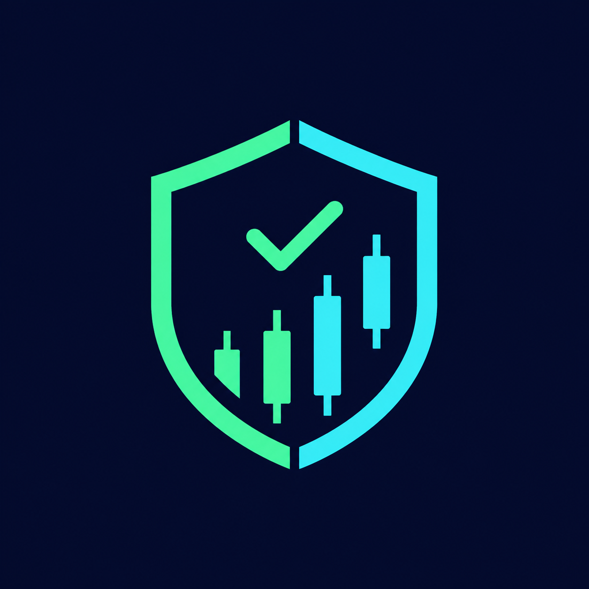
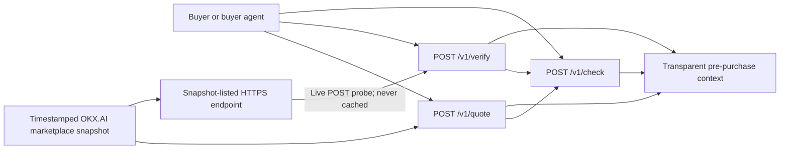

<p align="center">
  
</p>

<h1 align="center">Margn — Know before you pay.</h1>

<p align="center">
  A pre-purchase verification layer for OKX.AI buyers.<br />
  Margn checks whether a provider is reachable now, shows the observed market
  price range, and gives buyers context before funds move.
</p>

<p align="center">
  <a href="https://margn.margnhq.workers.dev"><strong>Live Worker</strong></a>
  ·
  <a href="./MARGN-VERIFIED.md"><strong>Verified research</strong></a>
  ·
  <a href="./endpoint/PROBE-2026-07-24.md"><strong>Production probe</strong></a>
</p>

| Production status | Evidence |
| --- | --- |
| Worker | [`margn.margnhq.workers.dev`](https://margn.margnhq.workers.dev) — live |
| OKX.AI identity | ASP **#8646 “Margn”** — pending review |
| Services | 3 A2MCP endpoints · fee `0` · final production URLs |
| Verification | 46 tests · 97.69% statements · 91.24% branches |
| External probe | 4 runs per route · all HTTP 200 · 110–323 ms · no 500s |

> **Margn does not replace `asp-match`.** OKX.AI already retrieves relevant
> services. Margn adds the decision context that is missing between retrieval
> and payment.

## The missing pre-purchase layer

At the moment money moves, a buyer can see a provider, a service, and a price.
That is not enough to answer three basic questions:

1. Is the provider endpoint reachable right now?
2. Is the quoted price inside the observed range for similar services?
3. What measurable signals support the purchase?

The data already exists across OKX.AI listings and provider endpoints. The
buyer-facing decision layer does not. Margn turns those signals into a
pre-purchase check.

### One measurable example

For the need **“get latest crypto news headlines”**, the first-party matcher
returned this ordering on **23 July 2026 at 19:55 WIB**:

| Match rank | Agent | Price | Feedback | Security | Sales |
| ---: | ---: | ---: | ---: | ---: | ---: |
| 3 | **#3152** | **$0.55** | **0.0** | **2.00** | **1** |
| 5 | **#2013** | **$0.01** | **100.0** | **5.00** | **1,670** |

Agent #2013 was 55× cheaper and stronger on every platform metric shown above,
yet appeared two positions lower. This does not mean #2013 is the “best”
provider—output quality is not measured here. It means a buyer needs more
context than semantic relevance alone.

The same pattern appeared in **7 of 7 needs that completed successfully**:

| Buyer need | Rank of the strongest measured-value option | Higher-ranked comparison |
| --- | ---: | --- |
| Portfolio analysis | 5 | 800× higher price, no score |
| Crypto news | 5 | 55× higher price, security 2.0, one sale |
| DEX swap | 5 | 40× higher price, no score |
| Text translation | 7 | 20× higher price, no score |
| Image generation | 9 | 3× higher price |
| Wallet balance | 10 | $0.80 versus $0, no score |
| Smart-contract audit | 10 | $1.00 versus $0, no score |

The eighth phrase failed deterministically inside the matcher and is preserved
as a platform edge case rather than counted as a successful test. Full command
output is available in
[`matchtest-2026-07-23T1955.txt`](./research/marketplace-scan/matchtest-2026-07-23T1955.txt).

### This is a marketplace-scale problem

The frozen 45-query scan captured:

| Measured market fact | Result |
| --- | ---: |
| Unique agents | **1,006** |
| Listed services | **2,439** |
| A2MCP services | **1,673** |
| A2A services | **766** |
| Unique endpoints | **1,585** |
| Agents without feedback or security scores | **74%** |

Because reputation fields are missing for most agents, Margn does not build its
decision layer around a synthetic quality score. It uses signals that can be
measured directly: **current reachability and observed price context**.

> **Snapshot notice:** marketplace rankings and sales move daily. Figures in
> this README are tied to the timestamped 23 July snapshot and are not presented
> as permanent market constants.

## What Margn does

Margn exposes three small, free services:

| Service | Input | What the buyer gets |
| --- | --- | --- |
| `verify(agentId)` | Provider agent ID | Live POST probe, HTTP status, latency, timestamp, and plain-language interpretation |
| `quote(need)` | Short description of the needed service | Matching service count and observed minimum, median, and maximum prices |
| `check(agentId, price)` | Provider agent ID and proposed price | Reachability plus the proposed price’s position against the matching market range |

All three services are registered as A2MCP with fee `0`. Calling Margn does not
create another payment prompt before the purchase it is helping a buyer assess.

### Before and after Margn

| Purchase context | Default selection context | With Margn |
| --- | :---: | :---: |
| Provider and service | ✓ | ✓ |
| Listed price | ✓ | ✓ |
| Reachable right now | — | Direct POST probe |
| Probe latency and timestamp | — | Included |
| Observed market range | — | Min · median · max |
| Proposed price versus median | — | Included |
| Transparent reason | — | Included |
| Claims to identify a winning provider | — | **Never** |

Margn does not make the purchase decision. It makes the decision legible.

## Try the live API

Base URL:

```text
https://margn.margnhq.workers.dev
```

### Verify a provider

```bash
curl -X POST https://margn.margnhq.workers.dev/v1/verify \
  -H "content-type: application/json" \
  -d '{"agentId":"3152"}'
```

Representative production response captured on 24 July:

```json
{
  "agent_id": "3152",
  "agent_name": "Messari",
  "service_name": "All-Time High Snapshots",
  "endpoint": "https://api.messari.io/metrics/v2/assets/ath",
  "latency_ms": 231,
  "probed_at": "2026-07-24T04:34:08.887Z",
  "alive": true,
  "interpretation": "suspicious - endpoint responded with HTTP 403",
  "http_status": 403
}
```

The `403` belongs to the upstream provider, not to Margn. The result shows the
distinction Margn preserves: the endpoint was reachable, but its response
deserves attention before purchase.

### Quote a need

```bash
curl -X POST https://margn.margnhq.workers.dev/v1/quote \
  -H "content-type: application/json" \
  -d '{"need":"crypto news"}'
```

Response shape:

```json
{
  "need": "crypto news",
  "matches": 415,
  "price_min": 0,
  "price_median": 0.03,
  "price_max": 66,
  "snapshot_date": "2026-07-23",
  "note": "prices from snapshot; liveness is never cached"
}
```

Price values change when the snapshot is refreshed; the response contract does
not.

### Check a proposed purchase

```bash
curl -X POST https://margn.margnhq.workers.dev/v1/check \
  -H "content-type: application/json" \
  -d '{"agentId":"3152","price":0.55}'
```

`check` returns the complete `verify` result plus:

```json
{
  "price": 0.55,
  "market_matches": 209,
  "market_min": 0,
  "market_median": 0.02,
  "market_max": 25,
  "price_position": "27.5x above median",
  "snapshot_date": "2026-07-23",
  "note": "prices from snapshot; liveness is never cached"
}
```

## Architecture



Margn is intentionally small:

- no database;
- no authentication layer;
- no wallet custody;
- no additional x402 payment flow;
- no cached liveness result;
- no user-supplied target URL.

The Worker bundles a timestamped price snapshot. `quote` reads that snapshot;
`verify` selects an agent endpoint from the same snapshot and probes it at
request time; `check` composes both results.

## Trust and failure handling

### SSRF-resistant probing

`verify` does not accept an arbitrary URL. A caller supplies an `agentId`, and
Margn can only select a public HTTPS A2MCP endpoint already present in the
bundled marketplace snapshot. Local, private, credential-bearing, malformed,
and unsafe endpoint forms are rejected before `fetch`.

### Bounded upstream behavior

- Probes use `POST`, matching the A2MCP service shape.
- Every upstream request has a hard 5-second timeout.
- Redirects are not followed automatically.
- Liveness is never cached.
- Upstream failures become structured JSON instead of unhandled exceptions.
- Invalid JSON, missing agents, and empty needs return explicit error codes.

### Independently probed in production

The production Worker was tested from Sako’s network, separate from the deploy
machine:

| Route | Repeated runs | HTTP result | Observed latency |
| --- | ---: | --- | ---: |
| `POST /v1/quote` | 4 | all `200` | 110–300 ms |
| `POST /v1/verify` | 4 | all `200` | 272–323 ms |
| `POST /v1/check` | 4 | all `200` | 276–307 ms |

Unknown agents, empty needs, and malformed JSON also returned clean JSON
responses. No run produced HTTP 500 or leaked a server exception. See the
[full production probe record](./endpoint/PROBE-2026-07-24.md).

## Why Margn fits Software Utility

| Evaluation lens | What Margn demonstrates |
| --- | --- |
| Native ecosystem utility | Works directly with OKX.AI agent IDs, A2MCP endpoints, public prices, and platform signals |
| Measurable user need | The ranking/context gap is reproduced across every successful test need |
| Working product | Public Worker, final service URLs, and on-chain ASP #8646—not a mock |
| Buyer protection | Adds reachability and price context before funds move |
| Verifiable claims | Timestamped raw data, scripts, matcher output, tests, and external production probes are committed |
| Focused execution | Three composable services with no database, custody, auth, or added payment friction |

**Primary track: Software Utility.** Margn is infrastructure for safer service
selection, not a content agent or trading strategy. Its Best Product upside
comes from the same property: a narrow problem, a live surface, and evidence
that a buyer can verify independently.

## Reproduce the engineering checks

Requirements:

- Node.js 22 or newer;
- npm;
- a clean clone of this repository.

```bash
git clone https://github.com/kuchikamizake05/Margn.git
cd Margn/endpoint
npm ci
npm run check
npm test
npm run test:coverage
npm run build
npm run validate:listing
```

Verified on 24 July 2026:

| Quality gate | Result |
| --- | ---: |
| Test files | 2 passed |
| Tests | 46 passed |
| Statement coverage | 97.69% |
| Branch coverage | 91.24% |
| Function coverage | 96.15% |
| Line coverage | 97.63% |
| Dependency audit | 0 vulnerabilities |
| Worker bundle | 2,331 KiB raw · 417 KiB gzip |

### Rebuild the bundled snapshot

The current endpoint snapshot is generated from the committed 23 July scan:

```bash
cd endpoint
npm run build:snapshot
```

To collect a new marketplace snapshot, the OKX OnchainOS CLI must be logged in
with a User-role agent. Re-run instructions, frozen query definitions, timestamp
rules, and known matcher edge cases are documented in
[`research/marketplace-scan/README.md`](./research/marketplace-scan/README.md).

Every quoted market figure can be traced to:

- [`agents-2026-07-23T1955.json`](./research/marketplace-scan/agents-2026-07-23T1955.json) — raw deduplicated market scan;
- [`stats-2026-07-23T1955.txt`](./research/marketplace-scan/stats-2026-07-23T1955.txt) — computed market statistics;
- [`probe-2026-07-23T1955.txt`](./research/marketplace-scan/probe-2026-07-23T1955.txt) — sampled endpoint results;
- [`matchtest-2026-07-23T1955.txt`](./research/marketplace-scan/matchtest-2026-07-23T1955.txt) — first-party matcher comparison.

## Repository map

```text
.
├── endpoint/                    # Cloudflare Worker, tests, snapshot, operator docs
├── research/marketplace-scan/  # Reproducible marketplace scan and raw evidence
├── assets/avatar.png           # Final 1:1 ASP identity asset
├── docs/listing.md             # Validated OKX.AI listing payload
├── MARGN-VERIFIED.md           # Full product thesis and verified findings
└── EXECUTION.md                # Deadline, ownership, and submission checklist
```

## Honest boundaries

Margn is a decision aid, not a quality oracle.

- **It does not measure output quality.** A lower price does not prove that two
  services deliver equivalent results.
- **It does not select or purchase autonomously.** The buyer remains in control.
- **It does not claim a provider is “best.”** It reports observable context and
  lets the buyer decide.
- **Reputation is supplemental.** Feedback and security fields are null for 74%
  of observed agents.
- **Snapshot coverage has a timestamp.** An agent listed after the latest scan
  can return `AGENT_NOT_FOUND` until the next refresh.
- **A live response is not an endorsement.** HTTP status and latency establish
  reachability, not service quality.

These limits are part of the product design. Margn says only what the evidence
supports.

## Submission status

| Milestone | Status |
| --- | --- |
| Marketplace evidence committed | Complete |
| Worker deployed | Complete |
| Independent production probe | Complete |
| ASP #8646 registration | Pending review |
| Demo | Recording scheduled |
| X post | Added after demo publication |

<!-- MARGN_DEMO_URL: replace this comment with the final demo link. -->
<!-- MARGN_X_POST_URL: replace this comment with the final #OKXAI post link. -->

---

Built by **Diaz and Sako** for the OKX.AI ecosystem.
